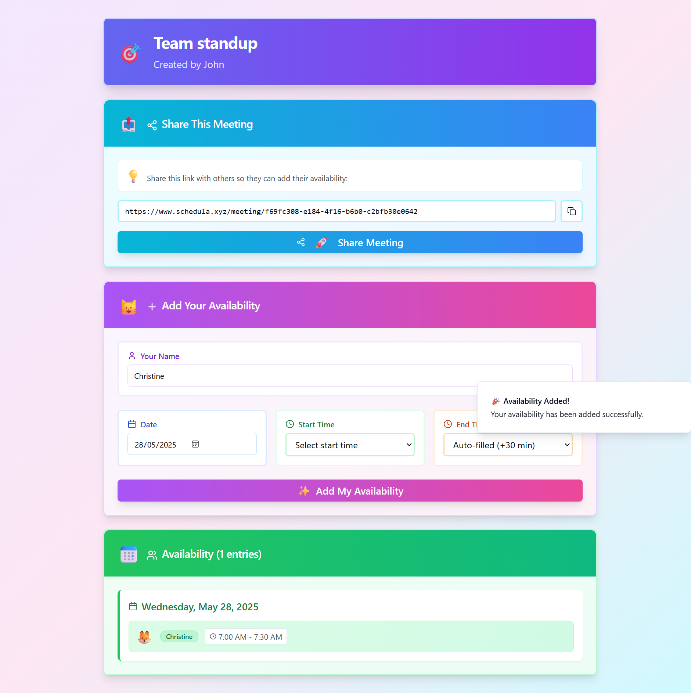

# Schedula: Effortless Meeting Coordination

**Transform chaotic scheduling into seamless coordination**

Schedula is a modern web application designed to streamline the process of finding optimal meeting times for teams and organizations. Eliminate back-and-forth email exchanges and scheduling conflicts with our intuitive, visual approach to availability management.



## ✨ Key Features

### 🎯 **Smart Meeting Management**

- **Instant Setup**: Create meetings in seconds with just a title and organizer name
- **Editable Details**: Update meeting information in real-time with inline editing
- **Unique Shareable URLs**: Each meeting generates a secure, shareable link
- **No Account Required**: Participants can join without creating accounts

### 📅 **Intelligent Availability Collection**

- **Visual Time Selection**: Intuitive interface for marking available time slots
- **Smart Suggestions**: Automatic end-time calculation (default +30 minutes)
- **Persistent User Data**: Remembers participant names using local storage
- **Flexible Scheduling**: Support for any date and time combination

### 📊 **Advanced Visualization**

- **Consolidated View**: Clear visual representation of all participant availability
- **Overlap Detection**: Automatically identifies common available time slots
- **Participant Tracking**: Real-time visibility of submission status
- **Mobile-Optimized**: Responsive design that works across all devices

## 🚀 Technology Stack

### **Frontend**

- **[React 18](https://reactjs.org/)** - Modern component-based architecture
- **[TypeScript](https://www.typescriptlang.org/)** - Type-safe development
- **[Vite](https://vitejs.dev/)** - Lightning-fast build tool and dev server
- **[Tailwind CSS](https://tailwindcss.com/)** - Utility-first styling framework
- **[shadcn/ui](https://ui.shadcn.com/)** - Professional component library
- **[React Router](https://reactrouter.com/)** - Client-side routing
- **[React Query](https://tanstack.com/query/)** - Server state management
- **[React Hook Form](https://react-hook-form.com/)** - Performant forms with validation

### **Backend & Infrastructure**

- **[Supabase](https://supabase.io/)** - PostgreSQL database with real-time features
- **[Vercel](https://vercel.com/)** - Edge deployment platform
- **[Redis](https://redis.io/)** - Caching layer for performance optimization

### **Development Tools**

- **[ESLint](https://eslint.org/)** - Code linting and formatting
- **[Playwright](https://playwright.dev/)** - End-to-end testing
- **Package Managers**: Bun (preferred) or npm

## 🛠️ Local Development Setup

### **Prerequisites**

- [Node.js](https://nodejs.org/) (LTS version recommended)
- [Bun](https://bun.sh/docs/installation) (recommended) or npm
- [Git](https://git-scm.com/)
- Supabase account for database

### **1. Clone the Repository**

```bash
git clone <YOUR_GIT_URL>
cd schedula
```

### **2. Install Dependencies**

```bash
# Using Bun (recommended)
bun install

# Or using npm
npm install
```

### **3. Environment Setup**

Create a `.env` file in the root directory:

```bash
cp env.example .env
```

Add your environment variables:

```env
# Supabase Configuration
VITE_SUPABASE_URL=your_supabase_project_url
VITE_SUPABASE_ANON_KEY=your_supabase_anon_key

# Optional: Redis Configuration
VITE_REDIS_URL=your_redis_url

# Optional: Analytics
VITE_VERCEL_ANALYTICS_ID=your_analytics_id
```

### **4. Database Setup**

#### **Supabase Configuration**

1. Create a new project at [Supabase](https://supabase.com/)
2. Navigate to the SQL Editor in your dashboard
3. Run the following SQL to create the required tables:

```sql
-- Create meetings table
CREATE TABLE meetings (
    id UUID DEFAULT gen_random_uuid() PRIMARY KEY,
    title TEXT NOT NULL,
    creator_name TEXT NOT NULL,
    created_at TIMESTAMP WITH TIME ZONE DEFAULT NOW(),
    updated_at TIMESTAMP WITH TIME ZONE DEFAULT NOW()
);

-- Create availability table
CREATE TABLE availability (
    id UUID DEFAULT gen_random_uuid() PRIMARY KEY,
    meeting_id UUID REFERENCES meetings(id) ON DELETE CASCADE,
    participant_name TEXT NOT NULL,
    available_date DATE NOT NULL,
    start_time TIME WITHOUT TIME ZONE NOT NULL,
    end_time TIME WITHOUT TIME ZONE NOT NULL,
    created_at TIMESTAMP WITH TIME ZONE DEFAULT NOW()
);

-- Create indexes for better performance
CREATE INDEX idx_availability_meeting_id ON availability(meeting_id);
CREATE INDEX idx_availability_date ON availability(available_date);

-- Enable Row Level Security (RLS)
ALTER TABLE meetings ENABLE ROW LEVEL SECURITY;
ALTER TABLE availability ENABLE ROW LEVEL SECURITY;

-- Create policies for public access (adjust as needed)
CREATE POLICY "Enable read access for all users" ON meetings FOR SELECT USING (true);
CREATE POLICY "Enable insert access for all users" ON meetings FOR INSERT WITH CHECK (true);
CREATE POLICY "Enable update access for all users" ON meetings FOR UPDATE USING (true);

CREATE POLICY "Enable read access for all users" ON availability FOR SELECT USING (true);
CREATE POLICY "Enable insert access for all users" ON availability FOR INSERT WITH CHECK (true);
CREATE POLICY "Enable delete access for all users" ON availability FOR DELETE USING (true);
```

### **5. Start Development Server**

```bash
# Using Bun
bun run dev

# Or using npm
npm run dev
```

The application will be available at `http://localhost:5173`

## 📦 Available Scripts

```bash
# Development
bun run dev          # Start development server
bun run build        # Build for production
bun run build:dev    # Build in development mode
bun run preview      # Preview production build
bun run lint         # Run ESLint

# Testing
npx playwright test  # Run end-to-end tests
```

## 🚀 Deployment

### **Vercel Deployment (Recommended)**

1. **Connect Repository**

   - Sign up at [Vercel](https://vercel.com/)
   - Import your Git repository

2. **Configure Build Settings**

   - Build Command: `bun run build` or `npm run build`
   - Output Directory: `dist`
   - Install Command: `bun install` or `npm install`

3. **Environment Variables**

   - Add all environment variables from your `.env` file
   - Ensure `VITE_SUPABASE_URL` and `VITE_SUPABASE_ANON_KEY` are set

4. **Deploy**
   - Vercel will automatically deploy on every push to your main branch

### **Custom Deployment**

The built files will be in the `dist/` directory after running `bun run build`. Deploy these static files to any hosting provider.

## 🎯 Use Cases

- **Corporate Teams**: Standup meetings, client calls, interviews
- **Educational Institutions**: Faculty meetings, student group projects
- **Consulting Firms**: Client scheduling and team coordination
- **Personal Projects**: Social gatherings and networking events

## 🔧 Project Structure

```
schedula/
├── src/
│   ├── components/          # React components
│   │   ├── ui/             # shadcn/ui components
│   │   ├── AddAvailability.tsx
│   │   ├── AvailabilityDisplay.tsx
│   │   ├── CreateMeeting.tsx
│   │   ├── MeetingView.tsx
│   │   └── ShareMeeting.tsx
│   ├── hooks/              # Custom React hooks
│   ├── integrations/       # External service integrations
│   │   ├── supabase/       # Supabase client and types
│   │   └── redis/          # Redis client
│   ├── lib/                # Utility functions
│   ├── pages/              # Page components
│   └── main.tsx            # Application entry point
├── public/                 # Static assets
├── docs/                   # Documentation
└── supabase/              # Supabase configuration
```

## 🤝 Contributing

We welcome contributions! Please feel free to:

1. Fork the repository
2. Create a feature branch (`git checkout -b feature/amazing-feature`)
3. Commit your changes (`git commit -m 'Add amazing feature'`)
4. Push to the branch (`git push origin feature/amazing-feature`)
5. Open a Pull Request

### **Development Guidelines**

- Follow TypeScript best practices
- Use conventional commit messages
- Ensure all tests pass before submitting
- Update documentation for new features

## 📋 Roadmap

### **Phase 1** ✅

- Core scheduling functionality
- Responsive web interface
- Basic availability visualization

### **Phase 2** 🔄

- Calendar integration (Google, Outlook, Apple)
- Advanced time zone management
- Email notifications and reminders

### **Phase 3** 📅

- Recurring meeting support
- Team scheduling templates
- Analytics and reporting dashboard

### **Phase 4** 📅

- Mobile applications (iOS/Android)
- API for third-party integrations
- Enterprise features (SSO, user management)

## 🔒 Security & Privacy

- **Data Encryption**: All data transmitted and stored with enterprise-grade encryption
- **Privacy First**: Minimal data collection with transparent policies
- **GDPR Compliant**: Full compliance with international data protection regulations
- **Secure Infrastructure**: Deployed on enterprise-grade cloud platforms

## 📄 License

This project is licensed under the MIT License - see the [LICENSE](LICENSE) file for details.

## 🆘 Support

If you encounter any issues or have questions:

1. Check the [documentation](./docs/)
2. Search existing [issues](../../issues)
3. Create a new issue with detailed information

---

**Ready to transform your meeting coordination?** 🚀 [Get started with Schedula today!](#-local-development-setup)
